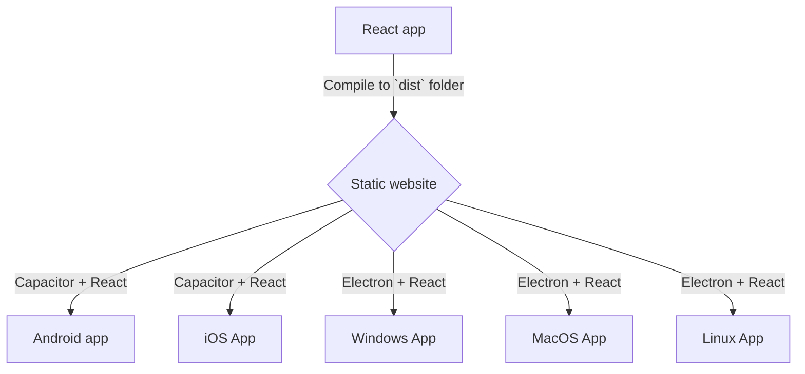

# BigfootDS Ionic Capacitor Multiplat Template

A template for a ReactJS front-end app built with TypeScript and Vite.

This template uses Ionic Capacitor to get to other platforms;

- Web (Ionic Capacitor)
- iOS (Ionic Capacitor, Xcode)
- Android (Ionic Capacitor, Android Studio)
- Windows (Ionic Capacitor, ElectronJS)
- Ubuntu (Ionic Capacitor, ElectronJS)
- MacOS (Ionic Capacitor, ElectronJS)



## First-Time Setup Steps

For when you make a brand-new project (NOT just cloning this repo, but making a new repo!):

1. Create the React + Vite app: `npm create vite@latest .`
2. Install its dependencies if you didn't from the previous step: `npm install`
3. Add Capacitor to the project: `npm install @capacitor/core`
4. Add the Capacitor CLI to the project: `npm install --save-dev @capacitor/cli`
5. Initialise Capacitor: `npx cap init`
6. Build the ReactJS app: `npm run build`
7. Initialise the Android project: `npx cap add android`
8. Initialise an app logo/asset generator per the documentation here: https://capacitorjs.com/docs/guides/splash-screens-and-icons 
9. Add the `capacitor-env` package to the project by running `npm install @capgo/capacitor-env && npx cap sync` - no `dotenv`, no `node:process`, just that package.
10. NOTE: This step will be modified to use ENV variables in future. Don't worry about this step here, it only impacts the local dev debugging of Android builds. Modify the `capacitor.config.ts` file so that it refers to the Android keystore for App installer signing:
```typescript
import type { CapacitorConfig } from '@capacitor/cli';

const config: CapacitorConfig = {
  appId: 'com.bigfootds.fidgettoys',
  appName: "Bigfoot's Fidget Toys",
  webDir: 'dist',
  android: {
    buildOptions: {
      releaseType: "AAB",
      keystorePath: "./release-keystore",
      keystorePassword: "SomeBetterPasswordOrEnvValueHere1",
      keystoreAlias: "SomeBetterAliasOrEnvValueHere",
      keystoreAliasPassword: "SomeBetterPasswordOrEnvValueHere2"
    }
  }
};

export default config;
```
11. Ensure Android Studio is installed on your development PC and ensure that it has a version of an Android SDK installed within it.
12. Run `npx cap open android` to open the project in Android Studio.
13. Keep an eye out for any prompts to upgrade the project from within Android Studio. Do them.
14. Using Android Studio, make a key store per the relevant bit of this guide, and save the key store file to the `android` folder in this repo: https://ionic.io/blog/building-and-releasing-your-capacitor-android-app 
15. If you make any changes to the ReactJS app at this point, you must tell the Android app to sync those changes into it: `npx cap sync`
16. With an Android phone with developer mode & USB Debugging enabled and plugged into the computer, run `npx cap run android` to build and run the app to your phone.
17. If the Android build fails with an error mentioning `getDefaultProguardFile('proguard-android.txt')`, find the `build.gradle` file in the project's `android/app/` directory. You need to modify the `buildTypes` object to make that `getDefaultProguardFile` function use a different file instead:

```gradle
    buildTypes {
        release {
            minifyEnabled false
            proguardFiles getDefaultProguardFile('proguard-android-optimize.txt'), 'proguard-rules.pro'
        }
    }
```

18. Add this library to get more handy ReactJS hooks: `npm install react-use && npx cap sync`


## General Workflow Steps

For people working in this repo after it's already been created:

1. Do your ReactJS work.
  - Avoid Capacitor- or Electron-specific solutions or implementations of features. Keep the ReactJS codebase agnostic to either framework!
3. Preview your ReactJS app in a web browser: `npm run dev`
3. Sync the ReactJS app into the Capacitor Android project, and run the Android project: `npm run android:run`
4. Build the Android app when ready to make an installable file: `npm run android:build`
5. 
